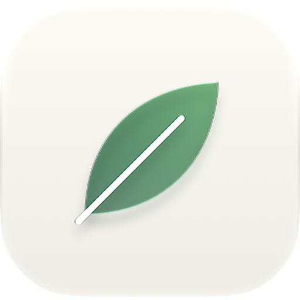
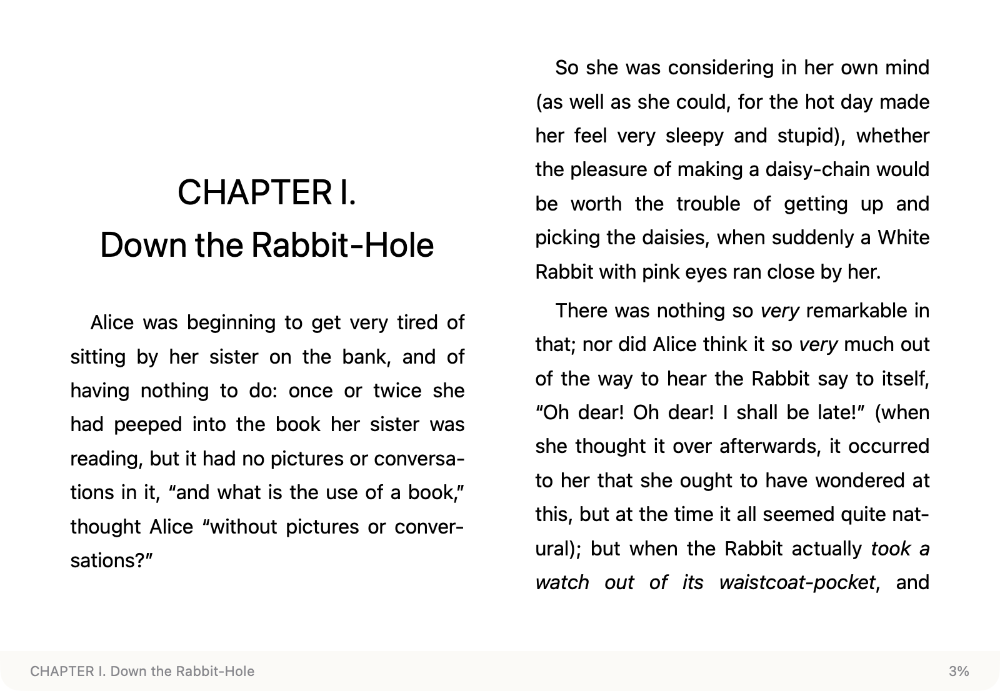

<p align="center">
  
</p>

<h1 align="center">Leaf</h1>

<p align="center">
  Open. Read. Close. A macOS ebook reader that only reads.<br>
  打开，阅读，关上。一个只做阅读的 macOS 电子书阅读器。
</p>

<p align="center">
  <a href="https://github.com/chengffei/leaf/releases/latest/download/Leaf.dmg"><b>Download</b></a> ·
  <a href="https://chengffei.github.io/leaf/">Website</a> ·
  <a href="#中文">中文</a>
</p>

<p align="center">
  
</p>

## Why Leaf

Most readers ask you to build a library before you can read. Leaf does the opposite: double-click a book in Finder and it opens; close the window and the app quits. No bookshelf, no importing, no copies of your files — and it remembers where you left off.

## Features

- **Three formats:** EPUB, MOBI and AZW3 (MOBI/AZW3 must be DRM-free)
- **Remembers your place:** books are recognized by content, even after renaming or moving
- **Native contents sidebar:** toggle with `⌘T`, highlights the current chapter, click to jump, click the page to hide it
- **Type controls:** font size 80–200%, three line-spacing presets, original / sans / serif fonts
- **Small and native:** SwiftUI + WebKit, follows system light/dark appearance, about 2.4 MB download

## Install

1. Download [Leaf.dmg](https://github.com/chengffei/leaf/releases/latest/download/Leaf.dmg) and drag Leaf into Applications.
2. **First launch:** Leaf is not notarized by Apple, so macOS blocks it once. Open it and dismiss the warning, then go to *System Settings › Privacy & Security*, scroll down and click **Open Anyway**.

Requires macOS 15 or later.

## Shortcuts

| Action | Keys |
|---|---|
| Turn page | `←` `→` · Space · swipe left/right on the trackpad |
| Contents | `⌘T` or `t` |
| Font size | `⌘=` larger · `⌘-` smaller · `⌘0` actual size |
| Font and line spacing | `Aa` in the top-right corner |

## Build from source

Requires Xcode 26 and [XcodeGen](https://github.com/yonaskolb/XcodeGen):

```sh
xcodegen generate
./scripts/install.sh      # build and install to /Applications
./scripts/make-dmg.sh     # package a DMG into ~/Downloads
```

Architecture notes and known pitfalls are in [DEVELOPMENT.md](DEVELOPMENT.md) (Chinese).

## Credits

Rendering and format parsing by [foliate-js](https://github.com/johnfactotum/foliate-js) (MIT). Sample books in `TestBooks/` are from [Project Gutenberg](https://www.gutenberg.org/) and in the public domain.

## License

[MIT](LICENSE)

---

## 中文

### 为什么做 Leaf

大多数阅读器先让你建书库、导入、整理，然后才能读。Leaf 反过来：在访达里双击一本书就打开，读完关掉窗口就退出。没有书架，不复制你的文件，下次打开自动回到上次读到的地方。

### 功能

- **三种格式**：EPUB、MOBI、AZW3（AZW3/MOBI 须无 DRM）
- **记住位置**：按文件内容识别，改名、挪位置也认得
- **原生目录侧栏**：`⌘T` 开关，高亮当前章节，点击跳转，点正文自动收起
- **字体与行距**：字号 80%–200%，行距三档，字体可选原书 / 黑体 / 宋体
- **原生轻量**：SwiftUI + WebKit，跟随系统深浅色，安装包约 2.4 MB

### 安装

1. 下载 [Leaf.dmg](https://github.com/chengffei/leaf/releases/latest/download/Leaf.dmg)，把 Leaf 拖进「Applications」
2. **第一次打开**：Leaf 没有经过 Apple 公证，系统会先拦下。按下面操作放行一次：
   双击 Leaf 后点「完成」→ 打开「系统设置 › 隐私与安全性」→ 拉到底部点「仍要打开」

需要 macOS 15 或更高。

### 快捷键

| 操作 | 按键 |
|---|---|
| 翻页 | `←` `→` · 空格 · 触控板左右滑 |
| 目录 | `⌘T` 或 `t` |
| 字号 | `⌘=` 放大 · `⌘-` 缩小 · `⌘0` 还原 |
| 字体与行距 | 窗口右上角 `Aa` |

### 从源码构建

需要 Xcode 26 与 [XcodeGen](https://github.com/yonaskolb/XcodeGen)：

```sh
xcodegen generate
./scripts/install.sh      # 构建并安装到 /Applications
./scripts/make-dmg.sh     # 打包 DMG 到 ~/Downloads
```

架构和踩过的坑见 [DEVELOPMENT.md](DEVELOPMENT.md)。

### 致谢

排版与格式解析由 [foliate-js](https://github.com/johnfactotum/foliate-js)（MIT）完成。`TestBooks/` 中的样书来自 [Project Gutenberg](https://www.gutenberg.org/)，属公有领域。

### 协议

[MIT](LICENSE)
